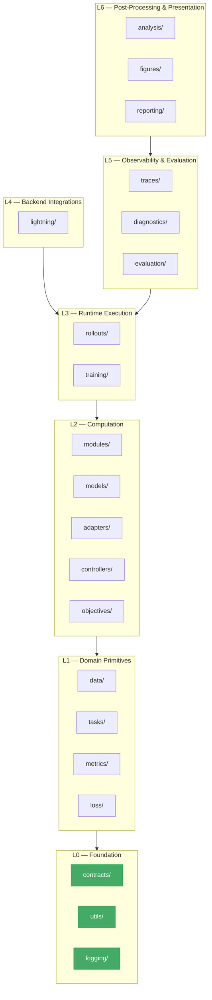

# Contract Architecture

> Canonical design for `ehp_sn.contracts` — the stable semantic boundaries
> between independently owned subsystems.

<!--
  canonical_package: ehp_sn
  implementation_package: ehc_sn  (temporary, during migration)
  authority: canonical
  status: accepted
-->

## 1. Why a dedicated contract layer

Within EHP, several independently owned components must interoperate: task
environments, deliberation runtimes, controllers, learners, evaluation
orchestrators, trace observers, and analysis pipelines. A contract describes
what two such components may assume about each other — the minimum interface
that permits independent implementation, testing, and evolution.

The contract layer lives at the bottom of the dependency DAG. The repository
uses a six-layer architectural model:



**This graph is a layering constraint, not a complete import-permission map.**
It states that packages in higher layers may depend on packages in lower
layers, but not the reverse. It does **not** mean every package in a layer
may import every package in a lower layer. Individual package documents
declare their specific allowed dependencies.

The normal dependency rule is: **higher layer → same or lower layer**.
But layer numbers alone are insufficient. Some lateral dependencies must
be prohibited even when technically downward. Explicit per-package
allowlists in each design document are authoritative.

**Explicitly prohibited cross-layer dependencies:**

| From         | To           | Reason                                                          |
| ------------ | ------------ | --------------------------------------------------------------- |
| `training`   | `lightning`  | Training must remain backend-independent                        |
| `tasks`      | `models`     | Tasks define semantics, not architecture                        |
| `metrics`    | `models`     | Metrics consume predictions, not models                         |
| `figures`    | `evaluation` | Figures consume analysis data, not evaluation internals         |
| `analysis`   | `evaluation` | Analysis reads immutable artifacts, does not execute evaluation |
| `objectives` | `metrics`    | Objectives produce objective results; metrics consume them      |

`contracts/`, `utils/`, and `logging/` are siblings inside Layer 0. All three
may depend on the Python standard library and `structlog`. None imports from
Layer 1 or above.

**Lightning (`lightning/`) is a Layer 4 framework adapter**, not a domain
package. It depends on `training/`, `data/`, `metrics/`, `evaluation/`,
and other domain packages. No domain package (Layers 0–3, 5–6) may import
from `lightning/`. Dependency direction is:

```
lightning → training, models, objectives, metrics, data, evaluation
```

Not:

```
training → lightning
```

Every package in Layers 1–6 may import from `contracts/`. The contract
package must **not** import from any package in Layers 1–6.

---

### 1.1 Cross-package concept ownership (authoritative)

This table is the single point of truth for which package owns each
cross-cutting concept. When two documents appear to conflict, this table
resolves the conflict.

| Concept                   | Canonical owner | Also referenced in                              | Notes                                                                                       |
| ------------------------- | --------------- | ----------------------------------------------- | ------------------------------------------------------------------------------------------- |
| Metric definition         | `metrics`       | `evaluation`                                    | Metrics owns formulas and accumulation; evaluation selects and coordinates                  |
| Rollout lifecycle         | `rollouts`      | `training`                                      | Rollouts owns carry mechanism; training owns TBPTT boundary policy                          |
| Task semantics            | `tasks`         | `adapters`, `evaluation`                        | Tasks own meaning; adapters translate; evaluation scores                                    |
| Trace schema              | `traces`        | `analysis`, `figures`, `diagnostics`            | Traces owns vocabulary; all others read via `TraceReader` protocol                          |
| Artifact identity         | `contracts`     | `traces`, `evaluation`, `analysis`, `reporting` | Contracts owns `ArtifactKey`, `Provenance`, `ArtifactRef`; subsystems extend                |
| Loss primitives           | `loss`          | `objectives`                                    | Loss owns pure math; objectives compose and weight                                          |
| Model state               | `models`        | `controllers`, `rollouts`                       | Models own state type; controllers own control carry; rollouts own lifecycle                |
| Controller state          | `controllers`   | `rollouts`                                      | Controllers own decision state fields; rollouts own carry propagation                       |
| Model invocation          | `adapters`      | `controllers`, `rollouts`                       | Adapters own task→model translation + physical model call; controllers delegate to adapters |
| Control decisions         | `controllers`   | `rollouts`                                      | Controllers own halt/continue/action decisions; rollouts own when to stop                   |
| Backward execution        | `training`      | `lightning`                                     | Training owns backward policy; Lightning executes `loss.backward()` as primitive            |
| Checkpoint emission       | `training`      | `lightning`, `evaluation`                       | Training owns when; Lightning owns storage integration; evaluation owns selection           |
| TBPTT boundaries          | `training`      | `rollouts`, `models`                            | Training owns when boundaries occur; rollouts owns carry transform; models own hooks        |
| Objective composition     | `objectives`    | `training`                                      | Objectives compute `ObjectiveResult`; training decides weighting and backward               |
| Validation scheduling     | `training`      | `lightning`                                     | Training owns validation config (frequency, metrics); Lightning owns callback hooks         |
| Experiment wiring         | `experiments`   | `lightning`, `evaluation`                       | Experiments own task–model–version composition (no design document yet)                     |
| Visualization             | `figures`       | `analysis`, `reporting`                         | Figures own visual encoding; analysis computes data; reporting assembles                    |
| Dataset identity          | `data`          | `tasks`, `training`                             | Data owns references, manifests, storage; tasks own semantic interpretation                 |
| Operational logging       | `logging`       | All runtime packages                            | Logging owns record emission infrastructure (design not yet implemented)                    |
| Domain-neutral primitives | `utils`         | Multiple packages                               | Utils owns tensor validation, tree traversal, graph algorithms                              |

---

## 2. Contract ownership policy

Not every boundary type belongs in `contracts/`. A central `contracts/`
package containing every subsystem's public dataclasses creates excessive
fan-in, difficult versioning, and an architectural bottleneck.

`ehp_sn` uses three ownership categories:

### 2.1 Foundation contracts (in `contracts/`)

A type belongs in `contracts/` only when **all** of these hold:

1. Multiple domain packages use it.
2. No single package semantically owns it.
3. It has no dependency on higher-level implementation packages.
4. Its meaning is expected to remain stable across implementations.
5. Moving it out of a producer package prevents a real dependency cycle or inversion.

**Canonical foundation types:**

| Type                                  | Purpose                                                   |
| ------------------------------------- | --------------------------------------------------------- |
| `ArtifactKey`                         | Stable semantic identifier for one produced artifact      |
| `ArtifactRef`                         | Locator for one stored instance of an artifact            |
| `Provenance`                          | Immutable provenance for one produced artifact            |
| `SchemaVersion`                       | Typed schema version identifier                           |
| `Dependency` / `DependencyKind`       | Declarative dependency vocabulary                         |
| `TaskRuntime`                         | Task-owned runtime boundary for value-control controllers |
| `TaskEnvironmentAdapter`              | Transitional RL environment adapter                       |
| `ContractViolation` / `ContractError` | Contract error hierarchy                                  |
| `SerializableValue`                   | JSON-compatible value type                                |

**Cross-cutting capability protocols (may live in `contracts/`):**

| Protocol         | Purpose                          |
| ---------------- | -------------------------------- |
| `ArtifactReader` | Backend-neutral artifact reading |
| `ArtifactWriter` | Backend-neutral artifact writing |
| `Lifecycle`      | `setup` / `teardown` / `close`   |
| `Resettable`     | `reset()` semantics              |

### 2.2 Producer-owned contracts

Most subsystem contracts remain in the producer package. The producer
defines the meaning of the produced value; consumers import the
producer's public contract.

| Producer      | Owns                                                           |
| ------------- | -------------------------------------------------------------- |
| `rollouts`    | `StepRecord`, `RolloutChunk`, `RolloutResult`, `EpisodeReader` |
| `objectives`  | `ObjectiveResult`, `LossTerm`, `TaskStepEvaluation`            |
| `traces`      | `TraceReader`, `TraceSink`, `TraceQuery`, `TraceArtifact`      |
| `evaluation`  | `EvaluationPlan`, `EvaluationResult`, `EvaluationArtifact`     |
| `analysis`    | `AnalysisPlan`, `AnalysisResult`                               |
| `figures`     | `FigureId`, `FigureResult`, `FigureArtifact`                   |
| `reporting`   | `ReportDefinition`, `ReportArtifact`                           |
| `controllers` | `StepController`, `ControllerOutput`                           |
| `adapters`    | `BridgeAdapter`, `BridgeOutput`                                |
| `models`      | `ModelOutput`, `ModelState`                                    |
| `training`    | `TrainingResult`, `CheckpointRef`, `TrainingUnit`              |
| `diagnostics` | `DiagnosticFinding`, `DiagnosticReport`                        |
| `metrics`     | `RatioStat`, `MetricResult`                                    |
| `tasks`       | `TaskSpec`, `TaskScoringSpec`                                  |
| `data`        | `DatasetRef`, `DataSource`                                     |

Consuming a producer-owned contract is not an architectural violation:

```python
# Correct — consumer imports the producer's public contract
from ehp_sn.rollouts import StepRecord
from ehp_sn.objectives import ObjectiveResult
from ehp_sn.traces import TraceReader
```

### 2.3 Consumer-owned request contracts

When the consumer defines the capability it requires, the contract
belongs to the consumer. This follows the dependency-inversion principle:
the orchestrator defines the capability it needs; implementations adapt to it.

```python
# In evaluation/contracts.py — owned by evaluation
class EvaluatableModel(Protocol):
    def initialize_state(self, batch_size: int, device: torch.device) -> ModelState: ...
    def predict(self, inputs: ModelInput, state: ModelState) -> PredictionBatch: ...

# In training/contracts.py — owned by training
class TrainingBackend(Protocol):
    def fit(self, unit: TrainingUnit, plan: TrainingPlan) -> TrainingResult: ...
```

Use consumer-owned protocols for **execution capabilities**. Use
producer-owned dataclasses for **produced data**.

### 2.4 Decision heuristic

```
Q: Do multiple packages consume this type AND no single package owns its semantics?
   → Yes: contracts/

Q: Does a single package produce this value and define its meaning?
   → Yes: producer's public module (package/contracts.py or package/__init__.py)

Q: Does the consumer need to request a capability that implementations satisfy?
   → Yes: consumer's contracts.py as a Protocol

Q: Is this an implementation helper with no domain semantics?
   → Yes: utils/
```

---

## 3. Contract mechanisms

There is no single framework that covers static interfaces, tensor schemas,
runtime validation, configuration schemas, and behavioral conformance. EHP
uses a **standard mechanism per boundary**:

| Boundary                          | Standard mechanism                  | Purpose                           |
| --------------------------------- | ----------------------------------- | --------------------------------- |
| Behavioral interface              | `typing.Protocol`                   | What a component can do           |
| In-memory exchange value          | Frozen `dataclass`                  | Runtime request/result shape      |
| Tensor structure & invariants     | TorchRL `TensorSpec` / `Composite`  | Shape, dtype, device, value range |
| RL environment                    | TorchRL `EnvBase`                   | Reset, step, spec declaration     |
| Configuration & serialized schema | Pydantic (frozen, `extra="forbid"`) | TOML, JSON, artifact manifests    |
| Static conformance                | Pyright strict checking             | Signature compatibility           |
| Behavioral conformance            | `ehp_sn.contracts.testing.*`        | Executable checks per contract    |

This produces a standard architecture without forcing every subsystem into
the same abstraction.

---

## 4. Package structure

```
src/ehp_sn/contracts/
├── __init__.py              # Public API — re-exports all stable foundation contracts
├── errors.py                # ContractViolation, ContractError hierarchy
├── dependencies.py          # Declarative dependency vocabulary
├── task_runtime.py          # TaskRuntime, RuntimeReset, StepFeedback
├── task_step.py             # (LEGACY) TaskStepEvaluator, StepEvaluation
├── task_environment.py      # (TRANSITIONAL) TaskEnvironmentAdapter
├── artifacts.py             # ArtifactKey, ArtifactRef, Provenance, SchemaVersion
├── serialization.py         # SerializableValue, artifact envelope
├── identifiers.py           # RunId, TaskId, ModelId (cross-cutting identifiers)
├── _validation.py           # Boundary validators (not in public API)
└── testing/
    ├── __init__.py           # Public conformance API
    ├── runtime.py            # check_task_runtime()
    └── environment.py        # check_task_environment_adapter()
```

**What does NOT belong in `contracts/`:**

- `StepRecord` — owned by `rollouts`
- `ObjectiveResult` — owned by `objectives`
- `TraceReader` — owned by `traces`
- `EvaluationResult` — owned by `evaluation`
- `AnalysisResult` — owned by `analysis`
- `FigureResult` — owned by `figures`
- `ReportArtifact` — owned by `reporting`
- `DiagnosticFinding` — owned by `diagnostics`
- `TrainingResult` — owned by `training`
- `ModelOutput` — owned by `models`

These remain in their producer packages. Consumers import them from
the producer's public API.

---

## 4. Shared artifact contracts

Every persisted output in EHP must carry shared identity, version,
provenance, and producer metadata. These types live in `contracts/`
so that `evaluation/`, `traces/`, `analysis/`, `figures/`, and
`reporting/` all depend on the same neutral definitions.

```python
@dataclass(frozen=True, slots=True)
class ArtifactKey:
    """Stable semantic identifier for one produced artifact."""
    namespace: str        # e.g. "ehp"
    family: str           # e.g. "arena", "mec"
    name: str             # e.g. "grid_metrics"
    schema_version: int   # incremented when the output contract changes

@dataclass(frozen=True, slots=True)
class ArtifactRef:
    """Locator for one stored instance of an artifact."""
    key: ArtifactKey
    uri: str | None = None
    digest: str | None = None

@dataclass(frozen=True, slots=True)
class Provenance:
    """Immutable provenance for one produced artifact."""
    operation_name: str
    operation_version: int
    implementation_path: str      # qualified Python module path
    code_revision: str | None
    parameter_digest: str
    input_artifacts: tuple[ArtifactRef, ...]
    created_at: str               # ISO-8601
```

Subsystem-specific manifests (trace manifests, evaluation manifests,
analysis manifests) extend these shared types with subsystem-specific
metadata. A trace manifest adds `TraceFieldSpec` entries; an evaluation
manifest adds `EvaluationProtocol` fields. But every manifest starts
from the same `ArtifactKey` + `Provenance` base.

| Subsystem     | Manifest type        | Extends                                                |
| ------------- | -------------------- | ------------------------------------------------------ |
| `traces/`     | `TraceManifest`      | `ArtifactKey` + `Provenance` + field specs             |
| `evaluation/` | `EvaluationManifest` | `ArtifactKey` + `Provenance` + protocol + metric specs |
| `analysis/`   | `AnalysisManifest`   | `ArtifactKey` + `Provenance` + analysis definition     |

---

## 5. Stable public API

Consumers write:

```python
from ehp_sn.contracts import (
    # Runtime boundary
    TaskRuntime,
    RuntimeReset,
    StepFeedback,

    # Environment boundary (transitional)
    TaskEnvironmentAdapter,

    # Declarative dependencies
    Dependency,
    DependencyKind,
    model_view,
    record_field,
    run_metadata,

    # Artifact identity and provenance
    ArtifactKey,
    ArtifactRef,
    Provenance,

    # Errors
    ContractError,
    ContractViolation,
)

from ehp_sn.contracts.testing import (
    check_task_runtime,
    check_task_environment_adapter,
)
```

Legacy imports still resolve from submodules but are not re-exported from the
package root:

```python
from ehp_sn.contracts.task_step import TaskStepEvaluator, StepEvaluation  # legacy
```

---

### 5.0 Canonical invocation chain

The standard invocation path through the layered architecture is:

```
rollout runner
    → controller.step(carry, batch, context)
        → adapter(model, task_input, state)
            → model(input, state) → output, next_state
        → adapter.postprocess(output) → bridge_output
    → (carry, controller_output)
```

Ownership along this chain:

| Concern                                            | Owner         |
| -------------------------------------------------- | ------------- |
| Repeated temporal iteration and stop decisions     | `rollouts`    |
| One-step control transition and decision semantics | `controllers` |
| Task-to-model translation and physical model call  | `adapters`    |
| Neural computation                                 | `models`      |

The controller may invoke an adapter, but must not directly understand
task/model pairing details. The adapter is the sole coupling point between
a task and a model.

## 5. The three task-boundary contracts

The repository has three task-interaction seams, reflecting an evolution:

```
TaskStepEvaluator ──(legacy)──► TaskRuntime ──(canonical)
      │                              │
      │  fixed-instance               │  runtime-backed
      │  stateless evaluation               │  stateful reset/step
      │                              │
      └──────────┬───────────────────┘
                 │
      TaskEnvironmentAdapter
        (transitional — migrating to EnvBase)
```

### 5.1 `TaskRuntime` — canonical runtime boundary

```python
class TaskRuntime(Protocol[RuntimeState]):
    """Task-owned runtime boundary for value-control controllers.

    Owns:
        - Observation construction from task data.
        - Task-state transitions (may be degenerate for static tasks).
        - Reward semantics (correctness, progress, cost).
        - Termination and truncation rules.
        - Partial reset (halted slots get new episodes; continuing slots
          persist).

    Does NOT own:
        - Model forward pass.
        - Action selection.
        - Loss computation.
        - Optimizer stepping.
    """

    def reset(self, batch: Batch) -> RuntimeReset[RuntimeState]: ...
    def reset_slots(
        self,
        reset_mask: Tensor,
        batch: Batch,
        state: RuntimeState,
    ) -> RuntimeReset[RuntimeState]: ...
    def step(
        self,
        state: RuntimeState,
        task_output: object,
        action: Tensor,
        steps: Tensor,
    ) -> StepFeedback[RuntimeState]: ...
```

Exchange types:

```python
@dataclass(frozen=True, slots=True)
class RuntimeReset(Generic[RuntimeState]):
    observation: Batch                        # (B, ...) model input
    state: RuntimeState                       # updated runtime state
    metrics: Mapping[str, Tensor] = field(default_factory=dict)

@dataclass(frozen=True, slots=True)
class StepFeedback(Generic[RuntimeState]):
    reward: Tensor                            # (B, 1) float32
    terminated: Tensor                        # (B,) bool
    truncated: Tensor                         # (B,) bool
    next_observation: Batch                   # (B, ...) model input
    next_state: RuntimeState                  # updated runtime state
    metrics: Mapping[str, Tensor] = field(default_factory=dict)
```

**Key design decisions**:

- `RuntimeState` is a generic type variable — implementations own their
  concrete state type (`_MazeHardRuntimeState`, `SeqMazeRuntimeState`, etc.),
  not a union of all possible fields. This avoids the "all optional fields"
  anti-pattern.
- `RuntimeReset` and `StepFeedback` are frozen dataclasses with `slots=True`.
  The frozen constraint protects the container, not the contained tensors —
  callers must not mutate.
- Default mutables use `field(default_factory=dict)`, never `= {}`.
- `next_observation` is explicitly the model input for the _next_ step,
  separating observation construction (runtime-owned) from the model
  forward pass (controller-owned).

**Contract vs. TorchRL `EnvBase`**: `TaskRuntime` is deliberately NOT a
TorchRL environment. One physical task transition may contain many internal
deliberation steps (k-time vs. t-time). Trying to derive `TaskRuntime` from
`EnvBase` would conflate internal computation time with environmental time.

### 5.2 `TaskEnvironmentAdapter` — transitional RL adapter

```python
class TaskEnvironmentAdapter(Protocol):
    """Task-owned adapter for EnvBase-backed online RL rollouts.

    Converts task batches, model outputs, and controller state into the
    TensorDict format expected by a TorchRL EnvBase.

    Long-term target: replace with a native EnvBase implementation or
    a Transform around an EnvBase, eliminating this protocol.
    """

    def build_reset_td(self, batch: Batch) -> TensorDictBase: ...
    def build_env_step_td(
        self, env_td, *, reset_mask, action, task_output, data,
    ) -> TensorDictBase: ...
    def finalize_env_transition(
        self, previous_env_td, next_env_td, *, reset_mask, action,
        task_output, data,
    ) -> TensorDictBase: ...
    def extract_next_step_obs(self, carry: OnlineBootstrapCarry) -> Batch: ...
```

**Transitional status**: This protocol exists because the current online RL
path interleaves task data with TorchRL `TensorDict` shaping. The long-term
target is for RL environments to implement `EnvBase` directly, at which point
`TaskEnvironmentAdapter` becomes package-local or disappears.

**Known issue**: `extract_next_step_obs` references `OnlineBootstrapCarry`
from `controllers.contracts.actor_critic`, which creates an upward dependency
from Layer 1 to Layer 2. Resolution options:

1. **(Preferred)** Define the minimal bootstrap carry protocol in
   `contracts/` so both the adapter and the controller-owning module can
   depend on the same neutral type.
2. **(Accept)** Treat `controllers.contracts` as itself a Layer 1.5
   sub-layer — it imports no domain packages.

### 5.3 `TaskStepEvaluator` — legacy (in migration)

```python
class TaskStepEvaluator(Protocol):
    """Task-owned seam for evaluating one deliberation controller step.

    LEGACY — replaced by TaskRuntime. New code must implement TaskRuntime.
    """

    def evaluate_step(
        self, data, task_output, action, steps, runtime_state,
    ) -> StepEvaluation: ...

@dataclass(frozen=True, slots=True)
class StepEvaluation:
    reward: Tensor                     # (B, 1)
    terminated: Tensor                 # (B,)
    truncated: Tensor                  # (B,)
    metrics: Mapping[str, Tensor] = field(default_factory=dict)
    next_runtime_state: object | None = None
```

**Status**: Only `MazeHardStepEvaluator` implements this protocol. All
new tasks implement `TaskRuntime`. The contract module retains
`TaskStepEvaluator` during migration but does not re-export it from the
package root. Remove after all consumers are migrated.

---

## 6. Tensor specification — use existing mechanisms, not a custom spec

The contract layer should **not** introduce a custom `TensorFieldSpec`,
`TaskRuntimeSpec`, or general tensor-schema type. Those would duplicate
existing machinery:

| What you need to describe                       | Use this                                                          |
| ----------------------------------------------- | ----------------------------------------------------------------- |
| TorchRL `TensorDict`-compatible boundary        | TorchRL `TensorSpec` / `Composite`                                |
| Ordinary tensor argument (shape, dtype, device) | Docstring annotation plus focused validator                       |
| Complex nested `Batch` (dict of tensors)        | `Batch` protocol/schema owned by `ehp_sn.types` or data contracts |
| Config-level tensor shape validation            | Pydantic with custom validators                                   |

A custom `TensorFieldSpec` appears simple but will inevitably grow
requirements for nested dictionaries, variable-length sequences, symbolic
axes, bounded categorical values, masks, tensor trees, optional keys, and
batch-versus-event shape distinctions — at which point you have implemented
a weaker local version of a problem already solved by TorchRL or shape-typing
libraries.

**Rule**: Do not introduce a custom tensor spec type until there is a
concrete runtime that cannot be represented adequately using TorchRL
`TensorSpec`, documented annotations, or `Batch`-level protocols.

For `TaskRuntime` specifically, shape/dtype invariants are documented in the
exchange-type docstrings (`(B, 1) float32`, `(B,) bool`) and enforced by the
conformance suite (see §8). Individual runtimes may expose a TorchRL
`Composite` if their exchange values are naturally `TensorDict`-shaped, but
there is no mandatory `spec` property on the `TaskRuntime` protocol.

---

## 7. Declarative dependencies

The `Dependency` type is a narrow, declarative vocabulary for the evaluation
planning path:

```python
class DependencyKind(StrEnum):
    MODEL_VIEW = "model_view"       # a named output from model.trace_views()
    RECORD_FIELD = "record_field"   # a field on StepRecord or its snapshot
    RUN_METADATA = "run_metadata"   # a key in run-level metadata

@dataclass(frozen=True, order=True)
class Dependency:
    kind: DependencyKind
    name: str

model_view("mec.cells")      # → Dependency(MODEL_VIEW, "mec.cells")
record_field("halted")       # → Dependency(RECORD_FIELD, "halted")
run_metadata("task_name")    # → Dependency(RUN_METADATA, "task_name")
```

This type is consumed by:

- **Figure registry** — each figure declares its dependencies.
- **Plan compiler** — transitively resolves figure → aggregate → analysis
  dependencies into a `CompiledFigurePlan`.
- **Executor** — extracts only the requested views and fields, passing
  them to consumers as `StepContext`.

No component imports a model or trace implementation to declare what it
needs. The dependency is resolved by name at plan-compilation time.

---

## 8. Conformance testing

The most important addition to the contract layer is a scikit-learn-style
conformance suite. Type checkers verify signatures; conformance tests verify
behavior.

### 8.1 Capability declarations

Not every runtime invariant is universal. Checks that depend on task-specific
semantics must be gated on declared capabilities:

```python
from enum import StrEnum

class PostTerminalBehavior(StrEnum):
    """What happens when step() is called on an already-terminated slot."""
    NO_TRANSITION = "no_transition"
    """Calling step() on a terminated slot is a contract error."""
    AUTO_RESET = "auto_reset"
    """Terminated slots are transparently reset before the next step."""
    PRESERVE_TERMINAL = "preserve_terminal"
    """Terminated slots preserve their terminal reward and state."""

@dataclass(frozen=True, slots=True)
class TaskRuntimeCapabilities:
    """Declared behavioral capabilities of a TaskRuntime implementation.

    Conformance checks use these to decide which invariants apply.
    """
    supports_slot_reset: bool = True
    """Whether reset_slots() is implemented."""

    deterministic_given_seed: bool = True
    """Whether reset(batch) produces the same state when called repeatedly
    with identical input.  If False, reset may sample from a distribution
    (e.g. random start positions)."""

    allows_post_terminal_step: bool = False
    """If True, step() may be called on terminated slots."""

    post_terminal_behavior: PostTerminalBehavior = (
        PostTerminalBehavior.NO_TRANSITION
    )
    """Semantics when step() is called on an already-terminated slot."""
```

### 8.2 `check_task_runtime()`

```python
def check_task_runtime(
    runtime: TaskRuntime[RuntimeState],
    *,
    sample_batch: Batch,
    sample_action: Tensor,
    sample_task_output: Tensor,
    capabilities: TaskRuntimeCapabilities | None = None,
) -> None:
    """Verify that a TaskRuntime implementation satisfies the behavioral contract.

    Raises ContractViolation on first failure.

    If *capabilities* is None, a minimal set of universal checks is run.
    Provide a ``TaskRuntimeCapabilities`` to enable capability-gated checks.
    """
    if capabilities is None:
        capabilities = TaskRuntimeCapabilities()

    for check in _iter_task_runtime_checks():
        check(
            runtime,
            sample_batch=sample_batch,
            sample_action=sample_action,
            sample_task_output=sample_task_output,
            capabilities=capabilities,
        )
```

### 8.3 Universal checks (always run)

| Check                            | What it verifies                                              |
| -------------------------------- | ------------------------------------------------------------- |
| `check_reset_batch_width`        | `reset()` returns observation whose leading dim matches input |
| `check_reset_device_consistency` | All reset tensors are on the same device                      |
| `check_reset_returns_state`      | `reset()` state is not `None`                                 |
| `check_step_reward_shape`        | `step()` reward has shape `(B, 1)`                            |
| `check_step_terminated_shape`    | `step()` terminated has shape `(B,)`                          |
| `check_step_truncated_shape`     | `step()` truncated has shape `(B,)`                           |
| `check_inputs_are_not_mutated`   | Runtime does not modify input tensors in-place                |
| `check_step_next_obs_device`     | `next_observation` tensors are on the same device as input    |

### 8.4 Capability-gated checks

| Check                                | Capability gate                           | What it verifies                                    |
| ------------------------------------ | ----------------------------------------- | --------------------------------------------------- |
| `check_seeded_reset_reproducibility` | `deterministic_given_seed == True`        | `reset()` with same batch produces equivalent state |
| `check_slot_reset_isolation`         | `supports_slot_reset == True`             | `reset_slots(mask)` only resets masked slots        |
| `check_post_terminal_no_transition`  | `post_terminal_behavior == NO_TRANSITION` | `step()` on terminated slot raises or returns error |

**Note**: `check_deterministic_reset` and `check_terminated_slots_are_stable`
are intentionally NOT universal checks. Determinism may not hold when the
task samples new environments, procedural data, or randomized start/goal
positions. Post-termination behavior varies across task semantics.

### 8.5 `check_task_environment_adapter()`

```python
def check_task_environment_adapter(
    adapter: TaskEnvironmentAdapter,
    *,
    sample_batch: Batch,
) -> None:
    """Verify TaskEnvironmentAdapter contract conformance."""
    ...
```

### 8.6 Usage pattern

```python
# In tests/contracts/test_task_runtime.py
from ehp_sn.contracts.testing import check_task_runtime
from ehp_sn.tasks.mazehard.runtime import MazeHardRuntime

RUNTIME_CASES = [
    {
        "runtime": MazeHardRuntime(config=..., reward_projector=...),
        "sample_batch": {"input_ids": ..., "labels": ...},
        "sample_action": torch.zeros(8, dtype=torch.int64),
        "sample_task_output": ...,
        "capabilities": TaskRuntimeCapabilities(
            deterministic_given_seed=True,
            supports_slot_reset=True,
            allows_post_terminal_step=False,
        ),
    },
    {
        "runtime": SeqMazeRuntime(config=..., reward_projector=..., ...),
        "sample_batch": { ... },
        "sample_action": torch.zeros(8, dtype=torch.int64),
        "sample_task_output": ...,
        "capabilities": TaskRuntimeCapabilities(
            deterministic_given_seed=True,
            supports_slot_reset=True,
            allows_post_terminal_step=False,
        ),
    },
]

@pytest.mark.parametrize("runtime_case", RUNTIME_CASES)
def test_task_runtime_contract(runtime_case):
    check_task_runtime(**runtime_case)
```

The checker must be usable both with and without pytest — downstream
implementations should be able to call `check_task_runtime()` directly.

---

## 9. Error hierarchy

```python
class ContractError(Exception):
    """Base class for public contract failures."""

class ContractViolation(ContractError):
    """A value violates a declared runtime invariant."""

    def __init__(
        self,
        contract: str,
        *,
        field: str | None = None,
        expected: str | None = None,
        received: str | None = None,
        context: str | None = None,
    ) -> None:
        parts = [f"{contract} contract violation"]
        if field is not None:
            parts.append(f"  field: {field}")
        if expected is not None:
            parts.append(f"  expected: {expected}")
        if received is not None:
            parts.append(f"  received: {received}")
        if context is not None:
            parts.append(f"  context: {context}")
        super().__init__("\n".join(parts))


class UnsupportedCapabilityError(ContractError):
    """A component does not provide a required capability."""
```

Example:

```
StepFeedback contract violation
  field: reward
  expected: float32 tensor with shape (8, 1)
  received: float64 tensor with shape (8,)
```

Use `ContractViolation` for:

- Boundary failures that can genuinely occur at runtime (incompatible batch
  width, malformed external data, unsupported capability request).
- Conformance check failures.

Do **not** raise `ContractViolation` in every inner-loop operation.
Expensive shape/dtype validation belongs in the conformance suite or in
debug-only validation, not in the training hot path.

---

## 10. Validation strategy — three levels

| Level                          | Mechanism                              | When it runs                   |
| ------------------------------ | -------------------------------------- | ------------------------------ |
| **1 — Static**                 | Pyright strict checking                | CI, pre-commit                 |
| **2 — Development boundary**   | Explicit validators (`_validation.py`) | Tests, debug mode              |
| **3 — Behavioral conformance** | `check_task_runtime()` and similar     | Tests, CI, plugin registration |

### Level 2 validators (development only)

```python
# ehp_sn/contracts/_validation.py  (NOT in public API)

def validate_step_feedback(feedback: StepFeedback) -> None:
    """Validate StepFeedback tensor shapes, dtypes, and device consistency.

    Raises ContractViolation on first mismatch.
    Intended for tests and debug mode, NOT the training hot path.
    """
    B = feedback.reward.shape[0]
    _check_tensor("reward", feedback.reward, (B, 1), torch.float32)
    _check_tensor("terminated", feedback.terminated, (B,), torch.bool)
    _check_tensor("truncated", feedback.truncated, (B,), torch.bool)
```

These validators exist for debugging and test assertions. They are not called
automatically on every `runtime.step()` — that would add overhead and
synchronization in the training loop.

---

## 11. Client-side conformance

Add explicit static type annotations near runtime implementations:

```python
# In tasks/mazehard/runtime.py

_mazehard_runtime: TaskRuntime[_MazeHardRuntimeState] = MazeHardRuntime(...)
```

Or in a type-check-only block:

```python
from typing import TYPE_CHECKING

if TYPE_CHECKING:
    _: TaskRuntime[_MazeHardRuntimeState] = MazeHardRuntime(...)
```

Run Pyright with strict rules over the contracts package and all known
implementations. This catches signature drift before behavioral tests run.

Do not rely on `@runtime_checkable`. Runtime-checkable protocols verify
attribute existence, not full type signatures or behavioral semantics.

---

## 12. Pydantic — configuration and serialized data only

Pydantic is the right tool for:

- Experiment configuration (TOML → `ExperimentConfig`)
- Evaluation recipe configuration
- Checkpoint manifests
- Trace schemas
- Artifact metadata
- Supervisor configs (`MazeHardRuntimeConfig`, `SeqMazeRuntimeConfig`)

It is **not** the right tool for:

- Hot-path tensor exchange objects (`StepFeedback`, `RuntimeReset`)
- Runtime state
- Per-step model outputs

The distinction:

```python
# Serialized/configuration contract — use Pydantic
class RuntimeConfig(BaseModel):
    model_config = ConfigDict(extra="forbid", frozen=True)
    runtime: str
    max_steps: int = Field(gt=0)

# Runtime exchange contract — use frozen dataclass
@dataclass(frozen=True, slots=True)
class StepFeedback(Generic[RuntimeState]):
    reward: Tensor
    terminated: Tensor
    truncated: Tensor
    next_observation: Batch
    next_state: RuntimeState
    metrics: Mapping[str, Tensor] = field(default_factory=dict)
```

The current repository already follows this division. Maintain it.

---

## 13. TorchRL — environment boundary only

TorchRL is the standard for the RL environment boundary. It provides:

- `EnvBase` — abstract environment interface
- `TensorSpec` / `Composite` — tensor shape, dtype, device, and value
  space declarations
- `check_env_specs()` — rollout-based spec conformance verification
- `Transform` — observation/reward transformations

Professional pattern:

```python
from torchrl.envs import EnvBase
from torchrl.data import Composite, BoundedTensorSpec

class ArenaEnv(EnvBase):
    observation_spec: Composite
    action_spec: BoundedTensorSpec
    reward_spec: UnboundedContinuousTensorSpec
    done_spec: Composite

    def _reset(self, tensordict=None) -> TensorDict:
        ...

    def _step(self, tensordict: TensorDict) -> TensorDict:
        ...
```

Then:

```python
from torchrl.envs import check_env_specs

def test_arena_environment_contract():
    env = ArenaEnv(...)
    check_env_specs(env)  # Framework-provided conformance
```

Do **not** use `EnvBase` for:

- Deliberation runtimes (`TaskRuntime`). Internal computation time (k) is
  not environmental time (t).
- `TaskStepEvaluator`. It is being migrated to `TaskRuntime`.

---

## 14. Migration plan

### Phase 1 — Public API and dependency hygiene (now)

1. Re-export stable types from `ehp_sn/contracts/__init__.py`.
2. Add explicit `__all__`.
3. Create `ehp_sn/contracts/errors.py` with `ContractError`,
   `ContractViolation`.
4. Resolve the `OnlineBootstrapCarry` import in `task_environment.py`.
5. Mark `TaskStepEvaluator` as legacy in module docstring (already done).

### Phase 2 — Conformance suite (next)

1. Add `ehp_sn/contracts/testing/runtime.py` with `check_task_runtime()` and
   `TaskRuntimeCapabilities`.
2. Add `ehp_sn/contracts/testing/environment.py` with
   `check_task_environment_adapter()`.
3. Wire one test case per runtime implementation.
4. Add `_validation.py` with `validate_step_feedback()`.

### Phase 3 — TorchRL environment standardization (medium-term)

1. Define TorchRL specs for all environment-facing values.
2. Run `check_env_specs()` for genuine `EnvBase` implementations.
3. Move adapter implementations toward `EnvBase` or `Transform`.
4. Stop duplicating reward/done/action schema validation manually.

### Phase 4 — Legacy removal (long-term)

1. Migrate all `TaskStepEvaluator` consumers to `TaskRuntime`.
2. Remove `task_step.py`.
3. Remove `task_environment.py` if TorchRL owns the complete environment
   boundary.
4. Keep compatibility aliases only when external consumers or persisted
   artifacts require them.

---

## 15. What NOT to place here

`ehp_sn.contracts` must NOT contain:

| Category                         | Example                                 | Belongs in                                  |
| -------------------------------- | --------------------------------------- | ------------------------------------------- |
| Concrete implementations         | `MazeHardRuntime`, `ArenaEnv`           | `tasks/<task>/runtime.py`                   |
| Configuration assembly           | `build_runtime()`, `resolve_task()`     | `composition/` or `experiments/`            |
| Registries                       | `RUNTIME_REGISTRY`                      | `analysis/registries.py`                    |
| Domain model internals           | `TEMMemoryBanks`, `ACTCarry`            | Task-owned package                          |
| Generic utilities                | `flatten_dict`, `move_to_device`        | `utils/`                                    |
| Compatibility aliases            | `OldTaskRuntime = TaskRuntime`          | Avoid; remove instead                       |
| Paradigm-specific exchange types | `RLStepPayload`, `ACTControlPrediction` | Owned paradigm package                      |
| Custom tensor spec types         | `TensorFieldSpec`, generic spec objects | Use TorchRL `TensorSpec` or keep with owner |

A healthy rule: **`import ehp_sn.contracts` must execute without importing
any concrete environment, controller, model, or experiment code.** If it does,
something has been placed in the wrong layer.

---

## 16. Two-matrix architecture governance

Repository integration is defined through two separate matrices with opposite
axes. They answer different questions and must not be combined.

### 16.1 Static dependency matrix (import direction)

Rows are **importing** packages; columns are **imported** packages.
Answers: "Does package A import package B?"

```
consumer → dependency
```

| Cell value | Meaning                                                 |
| ---------- | ------------------------------------------------------- |
| `A`        | Allowed — documented in both packages' design docs      |
| `F`        | Forbidden — violates layering or ownership              |
| `U`        | Undeclared — import exists but no design doc permits it |
| `·`        | Absent — no import relationship                         |

This matrix is generated from static analysis of `import` statements.
CI enforces that `F` cells are empty and `U` cells are either documented
or removed.

### 16.2 Semantic integration matrix (data/capability direction)

Rows are **producing** packages; columns are **consuming** packages.
Answers: "What stable capability, value object, event, or artifact does
the row package provide to the column package?"

```
producer → consumer
```

| Cell value | Meaning                                                                              |
| ---------- | ------------------------------------------------------------------------------------ |
| `R`        | Required integration on a canonical pipeline                                         |
| `O`        | Optional integration or extension point                                              |
| `G`        | Legitimate relationship, but contract gap exists (no named type)                     |
| `I`        | Implementation coupling exists — consumer imports concrete type, should use contract |
| `F`        | Forbidden direct integration                                                         |
| `N`        | No direct relationship                                                               |

**Important**: `G` and `I` are different:

- `G`: integration is needed but not formally specified.
- `I`: integration exists, but the consumer imports a concrete implementation.

### 16.3 Target semantic integration matrix

Only meaningful direct integrations are listed. Unlisted pairs are `N` (none)
or `F` (forbidden — see §1 prohibited dependencies table).

| Producer      | Consumer      | Status | Contract                    | Owner                         |
| ------------- | ------------- | ------ | --------------------------- | ----------------------------- |
| `contracts`   | most packages | R      | shared vocabulary           | `contracts`                   |
| `utils`       | most packages | O      | helper calls                | `utils`                       |
| `tasks`       | `data`        | R      | task data specification     | `tasks`                       |
| `tasks`       | `rollouts`    | R      | `TaskRuntime`               | `contracts`/`tasks`           |
| `tasks`       | `objectives`  | R      | target semantics            | `tasks`                       |
| `tasks`       | `evaluation`  | R      | `TaskScoringSpec`           | `tasks`                       |
| `data`        | `training`    | R      | `DataSource`, `Batch`       | `data`                        |
| `data`        | `evaluation`  | R      | evaluation samples          | `data`                        |
| `data`        | `rollouts`    | O      | offline episodes            | `data`                        |
| `modules`     | `models`      | R      | neural components           | `modules`                     |
| `modules`     | `controllers` | O      | reusable blocks             | `modules`                     |
| `models`      | `adapters`    | R      | `ModelOutput`, `ModelState` | `models`                      |
| `models`      | `rollouts`    | R      | inference capability        | consumer protocol or `models` |
| `models`      | `training`    | R      | trainable state             | PyTorch / `models`            |
| `models`      | `evaluation`  | R      | evaluation capability       | `evaluation`                  |
| `adapters`    | `controllers` | R      | `BridgeOutput`              | `adapters`                    |
| `adapters`    | `objectives`  | R      | learning view               | `adapters`                    |
| `controllers` | `rollouts`    | R      | `StepController`            | `controllers`                 |
| `controllers` | `objectives`  | R      | control result              | `controllers`                 |
| `loss`        | `objectives`  | R      | pure functions              | `loss`                        |
| `metrics`     | `training`    | O      | accumulated metrics         | `metrics`                     |
| `metrics`     | `evaluation`  | R      | evaluation metrics          | `metrics`                     |
| `rollouts`    | `training`    | R      | `StepRecord`, trajectories  | `rollouts`                    |
| `rollouts`    | `evaluation`  | R      | `EpisodeReader`, episodes   | `rollouts`                    |
| `rollouts`    | `traces`      | R      | observable records          | `rollouts` / `traces`         |
| `objectives`  | `training`    | R      | `ObjectiveResult`           | `objectives`                  |
| `training`    | `logging`     | O      | run events                  | `logging`                     |
| `training`    | `traces`      | O      | execution traces            | `traces`                      |
| `training`    | `diagnostics` | O      | health observations         | `diagnostics`                 |
| `training`    | `evaluation`  | O      | `CheckpointRef`             | `training`                    |
| `lightning`   | `training`    | R      | backend implementation      | `training`                    |
| `lightning`   | `models`      | O      | module adaptation           | PyTorch / `models`            |
| `lightning`   | `objectives`  | O      | step adaptation             | `objectives`                  |
| `evaluation`  | `analysis`    | R      | `EvaluationResult`          | `evaluation`                  |
| `evaluation`  | `reporting`   | O      | summary artifacts           | `evaluation`                  |
| `traces`      | `analysis`    | R      | `TraceReader`               | `traces`                      |
| `traces`      | `diagnostics` | R      | `TraceReader`               | `traces`                      |
| `diagnostics` | `analysis`    | R      | `DiagnosticFinding`         | `diagnostics`                 |
| `diagnostics` | `reporting`   | R      | `DiagnosticReport`          | `diagnostics`                 |
| `analysis`    | `figures`     | R      | figure view models          | `analysis`                    |
| `analysis`    | `reporting`   | R      | scientific results          | `analysis`                    |
| `figures`     | `reporting`   | R      | `FigureArtifact`            | `figures`                     |

This gives approximately 42 legitimate direct edges across 21 packages.

---

## 17. Canonical processing pipelines

The repository defines five ordered pipelines. Each arrow should correspond
to one named type or protocol from the integration matrix.

### 17.1 Training pipeline

```
TaskSpec
   ↓
DataSource → Batch
   ↓
Adapter.prepare_model_input → ModelInput
   ↓
Model.forward → ModelOutput
   ↓
Controller / rollout execution → StepRecord
   ↓
Objective.evaluate_step → ObjectiveResult
   ↓
TrainingBackend.fit → TrainingResult + CheckpointRef
```

Contracts: `TaskSpec`, `DataSource`, `Batch`, `ModelInput`, `ModelOutput`,
`StepRecord`, `ObjectiveResult`, `TrainingResult`, `CheckpointRef`.

### 17.2 Evaluation pipeline

```
EvaluationPlan
    ├── TaskSpec
    ├── ModelRef
    ├── DatasetRef
    ├── MetricSpec[]
    └── TraceSpec (optional)
          ↓
EvaluationRunner
          ↓
RolloutResult / PredictionBatch
          ↓
MetricCollection.update / .compute
          ↓
EvaluationResult
          ↓
EvaluationArtifact
```

### 17.3 Observability pipeline

```
Model / controller / rollout / training
                  ↓
            TraceObserver
                  ↓
              TraceSink
                  ↓
            TraceArtifact
                  ↓
             TraceReader
             ↙         ↘
       diagnostics    analysis
```

Scientific traces and operational logging remain separate:

| Concern                       | Type         | Owner                  |
| ----------------------------- | ------------ | ---------------------- |
| Scientific state/activation   | `TraceEvent` | `traces`               |
| Operational event             | `LogRecord`  | `logging`              |
| Performance/distributed event | `Span`       | OpenTelemetry (future) |

### 17.4 Analysis pipeline

```
EvaluationArtifact
TraceReader
DiagnosticReport
Dataset metadata
        ↓
     Analyzer.run
        ↓
  AnalysisResult
        ↓
  FigureData (view models)
```

### 17.5 Presentation pipeline

```
AnalysisResult ────────┐
FigureArtifact ────────┼→ ReportBuilder.build → ReportArtifact
EvaluationSummary ─────┤
DiagnosticReport ──────┘
```

---

## 18. Machine-readable integration registry

The authoritative record of all integration edges lives in a TOML registry
checked into the repository. Static analysis and documentation are generated
from it.

```toml
# integration.toml — canonical integration edge registry
schema_version = 1

[[edge]]
producer = "controllers"
consumer = "rollouts"
kind = "runtime"
status = "required"
contract = "ehp_sn.controllers.StepController"
owner = "controllers"
producer_doc = "controllers.md#rollout-interface"
consumer_doc = "rollouts.md#controller-input"
test = "tests/integration/test_controller_rollout.py"

[[edge]]
producer = "traces"
consumer = "analysis"
kind = "artifact"
status = "required"
contract = "ehp_sn.traces.TraceReader"
owner = "traces"
schema = "ehp.trace/v1"
producer_doc = "traces.md#reader-api"
consumer_doc = "analysis.md#trace-input"
test = "tests/integration/test_trace_analysis.py"

[[edge]]
producer = "rollouts"
consumer = "evaluation"
kind = "artifact"
status = "required"
contract = "ehp_sn.rollouts.EpisodeReader"
owner = "rollouts"
schema = "episode/v1"
producer_doc = "rollouts.md#evaluation-output"
consumer_doc = "evaluation.md#episode-input"
test = "tests/integration/test_rollouts_evaluation.py"

[[edge]]
producer = "objectives"
consumer = "training"
kind = "runtime"
status = "required"
contract = "ehp_sn.objectives.ObjectiveResult"
owner = "objectives"
producer_doc = "objectives.md#training-output"
consumer_doc = "training.md#objective-input"
test = "tests/integration/test_objectives_training.py"

[[rule]]
consumer = "training"
forbidden_dependency = "lightning"
reason = "Training must remain backend-independent."

[[rule]]
consumer = "objectives"
forbidden_dependency = "metrics"
reason = "Objectives produce results; metrics consume them. Neutral statistics types live in contracts/."

[[rule]]
consumer = "figures"
forbidden_dependency = "traces.trace_tree"
reason = "Figures must use TraceReader protocol, not concrete trace storage."
```

Generate from this registry:

- Markdown integration matrix.
- Mermaid dependency graph.
- Heatmap visualization.
- Documentation completeness report.
- Integration test coverage report.
- Import-policy CI configuration.

The registry records **intended** architecture. Static analysis validates
**actual** imports against it.

---

## 19. Quality metrics

Metrics that evaluate architecture rather than raw type counts:

| Metric                                           | Target                 |
| ------------------------------------------------ | ---------------------- |
| Required integration edges with a named contract | 100%                   |
| Required edges documented by both sides          | 100%                   |
| Forbidden static imports                         | 0                      |
| Imports of another package's internal modules    | 0                      |
| Architectural cycles                             | 0                      |
| Persisted artifact schemas versioned             | 100%                   |
| Required edges with integration tests            | 100%                   |
| Concrete orchestrator dependencies               | 0 or explicitly waived |
| Undeclared cross-package imports                 | 0                      |
| Public API symbols with documented stability     | 100%                   |

Avoid arbitrary targets such as "fewer than 15 exports." A package may
legitimately expose more. Measure whether exports are intentional,
documented, stable, and cohesive.

---

## 20. Warning signs

The contract layer is drifting if:

- Most fields are `Optional`.
- Most values are typed as `Any`.
- It imports concrete model families or task implementations.
- It contains registries, factories, or wiring code.
- Changing one model requires editing a universal contract type.
- Contract objects have paradigm-specific branches (`if act_mode: ...`).
- Subsystem-specific result types (`FigureResult`, `AnalysisResult`)
  accumulate in `contracts/` instead of their producer packages.
- The package duplicates types already defined in task/model packages.
- Protocols contain more than ~5 methods.
- Tensor shape semantics exist only in docstring comments (no spec,
  no validator).
- There are no conformance tests.
- Errors are bare `assert` statements.
- `__init__.py` uses wildcard exports.
- Consumers routinely import private submodules instead of the public API.
- A custom tensor-spec type grows to duplicate TorchRL `TensorSpec`.
- Strings like `"step_counter"` accumulate as informal semantic tags.
