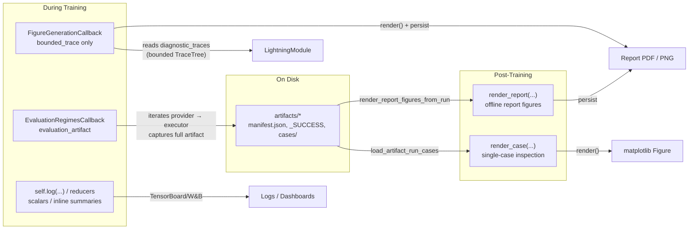
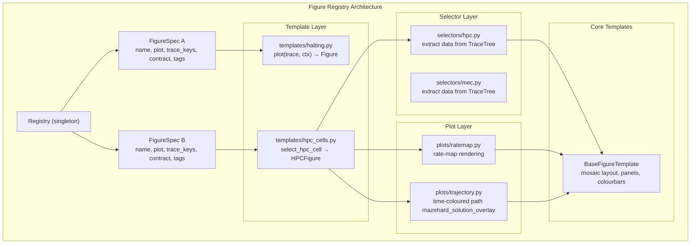

# Figures

Figure rendering uses the registry-based surface in `src/ehc_sn/figures` and is
scheduled from Lightning callbacks or triggered offline from persisted artifact
runs.



## Core Concepts

| Concept               | Module                | Description                                                                                                                                |
| --------------------- | --------------------- | ------------------------------------------------------------------------------------------------------------------------------------------ |
| `FigureSpec`          | `figures/registry.py` | Declarative spec for one named figure: plot function, required trace keys, input contract, metadata dependencies, shape constraints, tags. |
| `FigureContext`       | `figures/registry.py` | Render-time context: sample/env/frequency index, max items/cells, global step, split name, style layout.                                   |
| `REGISTRY`            | `figures/registry.py` | Central singleton holding all registered `FigureSpec` instances. Auto-populated on first use via `register_builtin_figures()`.             |
| `FigureKind`          | `figures/registry.py` | Lifecycle classification: `"dev"` (testing), `"diagnostic"` (analysis), `"report"` (publication).                                          |
| `FigureInputContract` | `figures/registry.py` | Minimum trace fidelity required: `"bounded_trace"`, `"evaluation_artifact"`, `"offline_artifact"`.                                         |

## The Two Key Distinctions

### 1. Figure Kind: Intended Use

- **`diagnostic`**: Analysis figures used during development, evaluation, and experiments. The majority of registered figures.
- **`report`**: Publication-quality figures (e.g. `mazehard_solution_overlay`). Only rendered through the offline report pipeline.

### 2. Input Contract: Fidelity Required

The contract determines **where** a figure can render:

| Contract              | Produced By                                       | Can Render In                                                            | Examples                                                            |
| --------------------- | ------------------------------------------------- | ------------------------------------------------------------------------ | ------------------------------------------------------------------- |
| `bounded_trace`       | Module diagnostic trace capture (validation step) | `FigureGenerationCallback`                                               | `halting_timeline`, `q_value_evolution`, `halt_logit_evolution`     |
| `evaluation_artifact` | Full evaluation regime run (provider + executor)  | `EvaluationRegimesCallback`, offline via `render_case` / `render_report` | `hpc_cells`, `mazehard_prediction_evolution`, `occupancy_histogram` |
| `offline_artifact`    | Persisted artifact loaded from disk               | Offline via `render_report` only                                         | `mazehard_solution_overlay`                                         |

## Figure Registry

Built-in figures are registered once, lazily, in `src/ehc_sn/figures/register.py`.
You can list available figures at any time:

```python
from ehc_sn.figures import list_figures, list_figure_specs

# Just names
list_figures()
list_figures(input_contract="bounded_trace")

# Full spec objects
list_figure_specs()
list_figure_specs(input_contract="bounded_trace")
```

### All Registered Figures

| Figure | Kind | Contract | Tags | Required Trace Keys |
| ------ | ---- | -------- | ---- | ------------------- |

TODO: update

### Capability-First Compatibility

Figures declare **required trace keys**, not model-family identity. A figure
renders for any model that produces those keys. For example, EHC and TEM share
the same trace vocabulary (both use the `"tem"` paradigm for spatial
diagnostics), so all `lec_*`, `mec_*`, and `hpc_*` figures work with EHC
artifacts without any family-specific configuration.

The `tags` field is for **human discoverability only**—it never gates rendering.

## User Workflows

Three pipelines match the three input contracts.

### 1. Online Bounded Diagnostics (`FigureGenerationCallback`)

For quick sanity-check figures during training. Only accepts `bounded_trace`
figures.

```python
from ehc_sn.callbacks.figures import FigureGenerationCallback

trainer = Trainer(
    callbacks=[
        FigureGenerationCallback(
            settings=FigureGenerationSettings(
                enabled=True,
                figures=["halting_timeline", "q_value_evolution"],
                every_n_epochs=5,
                max_cases=4,
                max_timesteps=128,
            )
        )
    ],
    logger=tb_logger,
)
```

**What happens:**

1. During `setup()`, the callback reads the required `trace_keys` from the
   configured figures and merges them into the module's
   `diagnostic_trace_spec`, enabling trace capture.
2. During each validation epoch, the module captures bounded `TraceTree` objects
   and exposes them via `module.diagnostic_traces`.
3. On the cadence trigger, the callback iterates available traces, applies
   `max_timesteps` slicing, calls `render()` for each figure, and persists
   results to disk (PDF/PNG) and TensorBoard.

**Resource guards:** `max_cases`, `max_items`, `max_cells`, `max_timesteps`,
`max_retained_files`.

**If you configure a non-bounded figure, the error tells you what to do:**

```
FigureGenerationCallback only supports bounded_trace figures.

  lec_figure_example
    requires: evaluation_artifact
    Use: add this figure to an EvaluationRegimesCallback regime to capture
    full eval artifacts, then render it offline with render_report().

Valid bounded_trace figures: halting_timeline, halt_logit_evolution,
q_value_evolution
```

### 2. Evaluation Artifact Generation (`EvaluationRegimesCallback`)

For full-fidelity evaluation runs that produce durable artifact bundles on disk.
Configures named evaluation regimes, each with a provider, schedule, and trace
request.

```python
from ehc_sn.callbacks.evaluation import EvaluationRegimesCallback

trainer = Trainer(
    callbacks=[
        EvaluationRegimesCallback(
            settings=EvaluationRegimesCallbackSettings(
                regimes=[
                    EvaluationRegimeSettings(
                        regime_id="arena_diag",
                        regime_kind="diagnostic",
                        provider_ref="ehc_sn.tasks.arena.providers.ArenaReplayProvider",
                        schedule=EvaluationScheduleSettings(
                            every_n_epochs=5,
                            max_batches=4,
                        ),
                        trace_request=EvaluationTraceRequestSettings(
                            enabled=True,
                            trace_keys=[
                                "diagnostic/lec/cells",
                                "diagnostic/mec/location_mean",
                                "diagnostic/hpc/location_mean",
                            ],
                        ),
                    )
                ]
            )
        )
    ]
)
```

**Output structure** (written atomically with `_SUCCESS` sentinel):

```
runs/my_experiment/artifacts/
  diagnostic/
    arena_diag/
      epoch-0005_step-00015000_epoch/
        manifest.json      # schema, status, provenance, temporal_semantics
        _SUCCESS           # sentinel — artifact is complete
        summary.json       # legacy compat
        cases/
          0000-case_000.dense.npz
          0000-case_000.meta.json
          0001-case_001.dense.npz
          0001-case_001.meta.json
```

The callback returns lightweight results (metrics only, no traces). Full traces
are written to disk immediately and reclaimed from memory.

### 3. Offline Report / Case Rendering

For publication figures and post-hoc analysis from persisted artifacts.

**Render a full report:**

```python
from ehc_sn.eval import render_report

result = render_report(
    artifact_run="runs/.../artifacts/diagnostic/arena_diag/epoch-0005_step-00015000_epoch",
    figures=[...],
    output_dir="reports/arena_epoch_0005",
)
```

**Inspect a single case interactively:**

```python
from ehc_sn.eval import load_artifact_run_cases, render_case

cases = load_artifact_run_cases(
    "runs/.../artifacts/diagnostic/arena_diag/epoch-0005_step-00015000_epoch"
)

fig = render_case("hpc_cells", cases[0])
fig.savefig("hpc_case_000.png")
```

For advanced usage, construct `OfflineReportRenderSettings` from TOML:

```toml
run_dir     = "runs/.../artifacts/diagnostic/arena_diag/epoch-0005_step-00015000_epoch"
output_dir  = "reports/arena_epoch_0005"
save_pdf    = true
save_png    = false

[[entries]]
figure    = "hpc_cells"
max_cases = 4
```

```python
from ehc_sn.eval.reports import (
    OfflineReportRenderSettings,
    render_report_figures_from_run,
)

settings = OfflineReportRenderSettings.model_validate(tomllib.loads(config_str))
render_report_figures_from_run(settings)
```

## Per-Regime Preview Figures (Optional)

`EvaluationRegimesCallback` can optionally render a small number of diagnostic
preview figures during regime execution, for quick visual inspection. Previews
are separate from full report rendering.

```python
[eval_regimes.regimes.figure_request]
enabled  = true
figures  = [...]
save_pdf = true
```

This is **not** the canonical report path — previews are limited to
`bounded_trace` and `evaluation_artifact` figures (not `offline_artifact`).

## Figure Validation

Every `FigureSpec` in the registry is validated at registration time.
Consumer sites enforce additional gates at config parse time:

| Consumer                          | Accepts                                   | Rejects                        |
| --------------------------------- | ----------------------------------------- | ------------------------------ |
| `FigureGenerationSettings`        | `bounded_trace`                           | All others (pedagogical error) |
| `EvaluationFigureRequestSettings` | `bounded_trace`, `evaluation_artifact`    | `offline_artifact`             |
| `OfflineReportRenderSettings`     | `evaluation_artifact`, `offline_artifact` | `bounded_trace`                |

All three consumers also enforce `FigureKind` gates (`kind != "report"` on the
training callbacks; `kind != "diagnostic"` on the offline report pipeline).

## Figure Registry and Architecture



### Figure Template Architecture

Each registered figure has a template module in `templates/` that exposes a
`plot(trace, ctx)` function. Complex multi-panel figures follow a three-layer
pattern:

1. **Selector** (e.g. `selectors/hpc.py`): Reads data from the `TraceTree`,
   computes rate maps and derived quantities. Returns a typed dataclass
   (e.g. `HPCCellFigureData`).
2. **Template** (e.g. `templates/hpc_cells.py`): Defines the mosaic layout and
   panel functions via `BaseFigureTemplate` and the `@panel` decorator.
3. **Plot** (e.g. `plots/ratemap.py`): Pure rendering functions for individual
   visual elements (rate maps, trajectories, autocorrelograms).

Simple single-panel figures (e.g. `halting_timeline`, `occupancy_histogram`,
`hidden_norm_histogram`) skip the selector layer and render directly from the
`TraceTree` or delegate to existing pure renderers in `metrics/renderers.py`.

## Outputs

Figure sinks write deterministic case-scoped filenames and can emit:

- **PDF** — primary publication format
- **PNG** — quick previews, configurable DPI
- **TensorBoard figures** — logged via `log_tensorboard_figure()` for in-training
  inspection alongside scalar curves

See `src/ehc_sn/figures/sinks.py` for naming and persistence behavior.

## Reference: Consumer-Site Boundary Rules

**Callbacks may:**

- Check cadence (`every_n_epochs`, `every_n_steps`)
- Request bounded diagnostic trace keys from the module
- Call `reducer.compute()` and pure renderer functions
- Log figures, scalars, or artifact references to loggers
- Enforce `failure_policy` (warn or raise)
- Reset reducer state after rendering

**Callbacks may not:**

- Accumulate unbounded traces across validation epochs
- Reconstruct task context or own task/provider semantics
- Own report rendering (reports are offline)
- Own cross-run analysis
- Decide scientific artifact schemas
